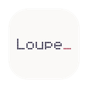

<p align="center">
  
</p>

# Loupe_

Real-time observer for Claude Code sessions. Streams tool calls, thinking blocks, approvals, errors, and agent activity into three display modes. TUI is the default view; press `w` for window mode.

## Install

```bash
bash scripts/install.sh
```

Configures 17 Claude Code hooks and compiles the native app. Loupe auto-starts on your next session.

```bash
npm start            # start (if not running)
npm run restart      # kill and restart
npm run stop         # stop everything
```

## Display Modes

### Window (default)

Native macOS app. Live event stream grouped by query, status bar (session state, errors, agents, tasks), multi-session vertical stacking with draggable panes.

### Dynamic Island

Notch-anchored pill. Adapts width to content. Pulses on approval/done, shows agent count, strikethrough on approve, red flash on reject.

Toggle: `Cmd+Shift+I`

### TUI

Interactive terminal dashboard. Auto-opens in Ghostty splits alongside the window.

- Queries grouped by session, collapsible
- `↑`/`↓` navigate, `→` drill in, `←` back out, `Enter` expand/collapse
- Detail view for full thinking text, prompts, tool I/O
- Agent tree pane, status line, session tabs (`1`-`9`)
```bash
LOUPE_PORT=8390 node src/tui/index.js
```

## Keyboard Shortcuts

| Key | Action |
|-----|--------|
| `Cmd+Shift+L` | Show/hide window |
| `Cmd+Shift+I` | Toggle Dynamic Island |
| `Cmd+Shift+M` | Compact/full mode |
| `m` | Toggle map |
| `/` | Search |
| `j`/`k` | Navigate |
| `1`-`9` | Switch session |

## Architecture

```
src/
  shared/          # CommonJS utils shared by server + TUI
  server/
    index.js       # WebSocket + file tailing (wiring only)
    http-routes.js # HTTP API endpoints + static serving
    backlog.js     # Client backlog delivery
    replay.js      # Session replay condensation
    session-tracker.js
    island-state.js
    watcher.js     # Thinking/rejection detection from transcripts
  tui/
    index.js       # Terminal UI
  ui/
    loupe-utils.js # Browser-side shared utils (loaded first)
    app.js         # Main wiring: WebSocket, state, keyboard
    app-parse.js   # Event categorization + extraction
    app-grouping.js# Task/query grouping
    app-island.js  # Dynamic Island bridge
    app-render.js  # DOM rendering for grouped events
    app-modal.js   # Detail modal
    app-replay.js  # Replay analysis UI
    gravity.js     # File dependency graph
    momentum.js    # Behavioral span graph
    tiling.js      # Binary tree pane layout
native/
  app.swift        # macOS app (island + WebView window)
```

## Web Access

```
http://localhost:8390
```
